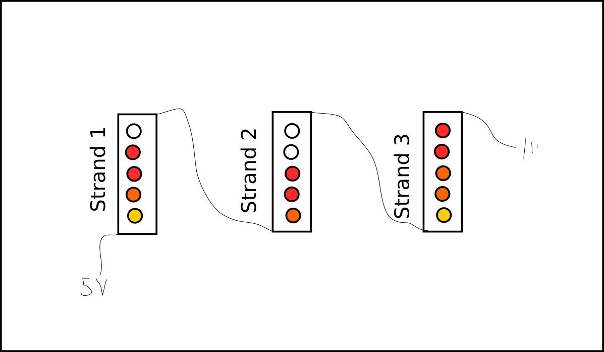

# Firelight

A ws2811 LED strip controller and fire effect renderer for
the Raspberry Pi, together with a REST interface for remote
control from an app or web interface.

This crate contains two binaries:

  - The `firelight-daemon` speaks to the hardware using the `ws2811` protocol.
    This must run as root since it requires direct memory access.
    It opens a unix domain socket where it accepts messages consisting of
    a sequence of raw u32 values in the format 0x00RRGGBB.

  - The `firelight-rest` server provides a simple REST API with a `/status` endpoint
    to query the current renderer state in JSON format and a `/control` endpoint to
    set it in the same format.

Or, in a graphical

               ws2811                 domain socket              Control                    ???
    hardware <--------> controller  <---------------> renderer <------------> server <------------> user
    
                    firelight-daemon                   (lib)              firelight-rest      (e.g.) homeassistant
    

The daemon can only run on a Raspberry PI because it needs to know the
model-specific memory offset of the video core memory and the DMA controller.

The server internally spawns a rendering thread that continually renders
the RGB light values according to the current state and sends them to
the daemon. The `debug-shell` binary can be used to just run the renderer
without a web server.

Currently, two effect modes are supported by the renderer: A `static` mode
that displays a constant color, and a `fire` mode that renders a roughly
flame-shaped dynamic light effect.

The server assumes that the LED strip is organized into several consecutive
*strands*. The idea is that these represent space-like separated parts
of the strip, which is still connected into a single circuit. Schematically,
it looks like this:

